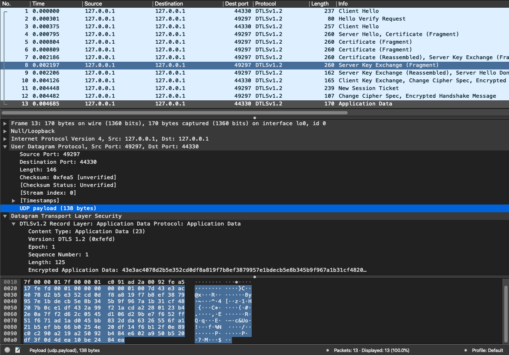
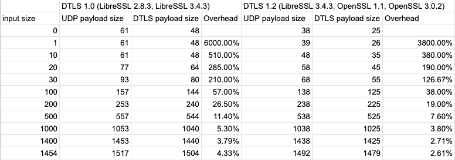
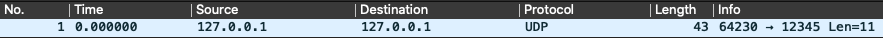
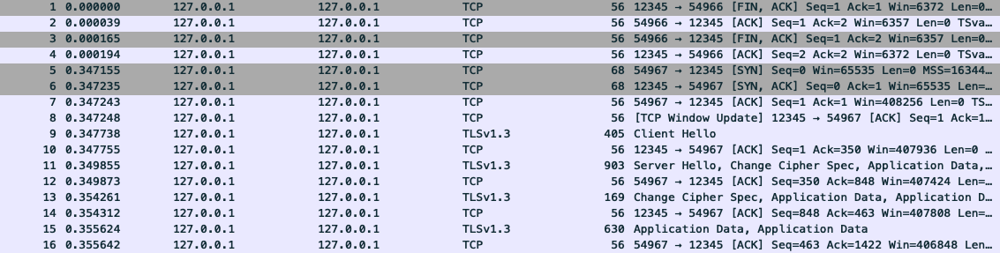

# DTLS experiment

This is an experiment to measure the sizes of DTLS messages for different sizes of payloads.

My initial intention was to test it using Node.js alone. Unfortunately, Node.js doesn't support DTLS and there is no npm library available either. The closest thing that resembles a working library is `@nodertc/dtls`, but it only implements the client part. I even tried `npm i github:nodertc/dtls#ee9a8e1` to fetch the most recent commit to date - which mentions a server part - but it doesn't work either as the server implementation is a work in progress (and it seems abandoned by now). So my idea here is to cheat and use openssl CLI tool to open both the client and the server and then send/receive data via pipes. It works just fine and could theoretically be used by a real application if needed - so check the code if you need to implement a DTLS client/server in Node.js for whatever reason.

## dtls-test.js

This is the main test. To run it, first make sure you have a compatible Node.js version by running `nvm i` (download nvm [here](https://github.com/nvm-sh/nvm)). Alternatively, see `.nvmrc` and manually install the version annotated there. 

To run the script:

    node dtls-test

It will start a server and then a client, and the client will then send a text message that will be echoed by the server process. I suggest having Wireshark open and filtering by `udp port 44330` on the loopback interface.

## Results

The table below shows what I collected from trying different payload sizes.

The first thing to mention is that I tried both DTLS 1.0 and 1.2, and they give different results. v1.2 produces more concise messages, so I will only focus in it below.

Each row shows a different input string size. It can be manually adjusted by changing `PAYLOAD_SIZE` in the code.

The simplest example sends an empty payload. It can be seen that v1.2 outputs a UDP payload size of 38 bytes. Of those, 25 are the actually payload, and the remaining 13 bytes are the DTLS header. This is the same header size seen through all payload sizes tried in this experiment.

Let's jump to the row where the input size is 100. It adds the same size of 25 bytes to the DTLS payload as seen in the empty input. So it seems that 25 bytes is our baseline payload. We can see again the 13-byte header, for a total of 138 bytes. That represents an increase of 38% with respect to the original payload, so very significant.

That constant overhead starts to dilute as we increase the input size. For 1000 bytes, the final size of 1038 only represents 3.8% of increase. It can be seen that DTLS adds a very significant bandwidth cost if your protocol frequently sends small messages.

We also conclude that 1454 is the maximum input payload size if you're required to fit the traditional 1500-byte MTU. That gives a UDP payload size of 1492 bytes, which can be summed to the 8-byte header of the UDP protocol to total 1500 bytes.

I tried the following openssl versions:

- libressl 2.8.3
- libressl 3.4.3
- openssl 1.1.1m
- openssl 3.0.2

And all four seem to always give the same output sizes - so no surprises here.

## Certificate creation

You will find certificates already generated in this repo to make it simple to just run the test, but I wanted to document here how I generated them anyway:

    openssl req -x509 -newkey rsa:2048 -keyout private-key.pem -out public-cert.pem -days 36500 -nodes

In the questions part, I answered only `Common Name` as `localhost` and just hit return for everything else.

## OpenSSL CLI

This is the basic command for starting a simple DTLS server:

    openssl s_server -key private-key.pem -cert public-cert.pem -accept 44330 -dtls1

And this is how you would open a client:

    openssl s_client -connect 127.0.0.1:44330 -dtls1

You can try it now in the command line and see it working. These commands should work just fine in macOS (tested) and Linux (not tested). Once the client is started, try typing in anything in the terminal and hit return to see the server echo it on its terminal window.

## Other scripts

I also wrote other quick tests to run pure UDP without encryption (`udp-test.js`):

And TCP with TLS encryption (`tls-test.js`):

